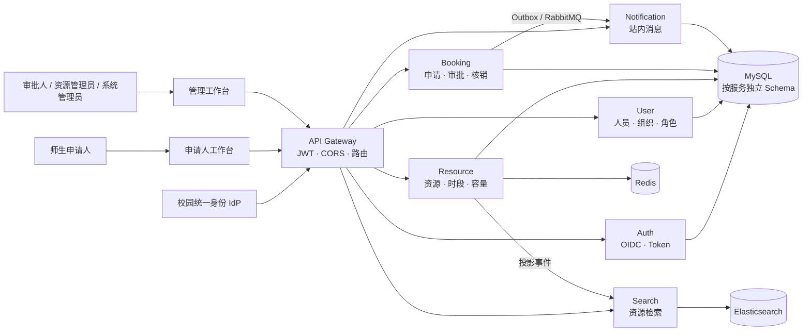

# VenueFlow · 校园资源预约与审批治理平台

> 面向高校部委、学院与职能部门的资源治理系统：把场地发布、开放排期、师生申请、多级审批、签到核销、消息通知和运营分析整合为一条可追踪的业务链路。

VenueFlow 是一个可完整运行的全栈工程作品。项目不是简单的 CRUD 示例，而是围绕“有限校园资源如何被安全、公平、可审计地分配”设计了 7 个独立服务、浏览器双工作台、标准 OIDC 身份接入、组织架构同步、1–5 级审批、容量一致性与最终一致性事件链路。

> 数据说明：仓库内的学校、人员、资源和预约记录均为合成演示数据，不代表真实学校运营或生产使用情况。

## 项目亮点

| 方向 | 落地能力 |
|---|---|
| 完整业务闭环 | 资源发布 → 开放时段 → 预约申请 → 多级审批 → 通知 → 签到核销 → 运营报表 |
| 分布式一致性 | 幂等命令、容量台账、事务 Outbox、消费者去重、超时释放与补偿协调 |
| 校园治理 | OIDC + PKCE、组织树全量/增量同步、基于组织与角色的权限边界、审批链快照 |
| 工程质量 | Java 21、Spring Boot 4、Flyway、Maven 多模块、CI、代码格式/静态检查、SBOM |
| 可运行作品 | Docker Compose 基础设施、一键启停/播种/冒烟验收、申请人端与管理端双工作台 |

## 系统全景



更完整的边界、时序、数据所有权和部署拓扑见 [架构文档](docs/architecture/README.md)。

## 核心工程设计

### 1. 容量不是一个可随意更新的数字

Resource 服务以容量台账处理占用、确认和释放；Booking 服务用幂等键约束重复提交。失败或超时通过补偿流程归还容量，避免浏览器重试和服务间失败导致超卖或重复预约。

### 2. 审批链在提交时固化

资源可配置归属组织与 1–5 个有序审批节点。申请创建时保存审批链快照，之后即使管理员调整模板，进行中的申请仍按原有责任链执行，保证审计语义稳定。

### 3. 可靠事件代替脆弱的“双写”

预约状态与 Outbox 事件在同一数据库事务内提交，再异步投递到 RabbitMQ。通知和搜索消费者使用事件标识去重，并保留重试与重建路径，使核心交易不依赖下游瞬时可用。

### 4. 身份、组织和权限形成治理边界

Auth 服务支持本地演示账户与标准 OIDC Authorization Code + PKCE；User 服务承接组织树全量/增量同步。Gateway 统一校验 JWT 并传递可信身份，服务端仍按角色、组织范围和当前审批节点执行授权。

## 技术栈

| 层次 | 技术 |
|---|---|
| 前端 | 原生 ES Modules、HTML5、CSS3、响应式双工作台、Node Test Runner |
| 网关与服务 | Java 21、Spring Boot 4.0.7、Spring Cloud 2025.1.2、Spring Security |
| 数据访问 | MyBatis-Plus 3.5.17、Flyway、MySQL 8.4 |
| 中间件 | Redis、RabbitMQ、Elasticsearch、Nacos（可选） |
| 可观测性 | Spring Boot Actuator、Micrometer、OpenTelemetry、Prometheus、Grafana |
| 工程化 | Maven Wrapper、GitHub Actions、JaCoCo、Spotless、SpotBugs、CycloneDX SBOM |

## 可验证的工程规模

以下数字来自当前仓库，可由 Git 或测试报告复核，不是生产运营指标：

- 7 个可独立启动的后端进程：Gateway + 6 个领域服务。
- 39 份主规格、28 个 Flyway 迁移、286 个生产 Java 源文件、88 个 Java 测试源文件。
- 当前本地 Surefire 报告累计 277 项测试，0 failure / 0 error；前端测试 19 项通过。
- 合成学期场景包含 7 个组织单元、16 名运营角色、10 个校园资源和 72 条跨约四个月的预约记录。

详细案例拆解见 [项目案例](docs/resume/project-case-study.md)，可直接改写的中英文简历表述见 [简历文案](docs/resume/resume-copy.md)，面试追问准备见 [面试指南](docs/resume/interview-guide.md)。

## 最快启动

环境要求：Windows PowerShell、JDK 21、Docker Desktop、OpenSSL。

```powershell
.\scripts\local-dev\start.ps1
python -m http.server 3000 --directory venueflow-web
```

访问入口：

- 申请人端：<http://127.0.0.1:3000/>
- 管理端：<http://127.0.0.1:3000/admin.html>
- Gateway：<http://127.0.0.1:8080>

本地脚本创建两个仅用于演示的入口：

```text
申请人：campus.user / Campus-User-2026!
管理员：campus.admin / Campus-Admin-2026!
```

凭据不得用于共享或生产环境。普通用户也可自行注册。

```powershell
.\scripts\local-dev\status.ps1
.\scripts\local-dev\smoke.ps1
.\scripts\local-dev\stop.ps1
```

完整验收步骤见 [5 分钟演示脚本](docs/resume/demo-script.md) 和 [校园管理端运行手册](docs/runbook/campus-administration.md)。

## 服务边界

| 服务 | 端口 | 核心职责 |
|---|---:|---|
| Gateway | 8080 | 路由、JWT 校验、CORS、可信身份上下文 |
| Auth | 8081 | 本地认证、OIDC、Access/Refresh Token |
| User | 8082 | 用户资料、组织架构、角色与预约资格 |
| Resource | 8083 | 资源目录、开放时段、规则、容量与审批策略 |
| Booking | 8084 | 申请、审批、取消、超时、核销与运营统计 |
| Notification | 8085 | 可靠事件消费与站内消息 |
| Search | 8086 | Elasticsearch 资源检索投影 |

联调时应使用 `persistence` 及所需附加 profile。推荐使用启动脚本，避免在 IDEA 中遗漏数据库、消息、搜索或 JWT 环境变量。

## 构建与验收

默认测试不依赖 Docker 或外部服务：

```powershell
.\mvnw.cmd clean verify
node --test venueflow-web/test/*.test.js
openspec.cmd validate --all --strict
```

全链路验收：

```powershell
.\scripts\local-dev\start.ps1
.\scripts\local-dev\smoke.ps1
```

## 仓库导航

- `venueflow-web/`：零运行时依赖的申请人端与管理端。
- `venueflow-*-service/`、`venueflow-gateway/`：网关与领域微服务。
- `docs/architecture/`：系统上下文、容器、时序、事件、数据与部署设计。
- `docs/resume/`：项目案例、简历文案、演示脚本和面试问答。
- `docs/runbook/`：启动、恢复、对账与校园管理操作手册。
- `scripts/local-dev/`：一键启动、播种、验收、状态检查和停止。
- `deploy/`：Docker Compose、可观测性与治理配置。
- `openspec/`：需求规格、变更提案与归档。

## 项目边界

VenueFlow 当前定位是“可完整演示、可深入讲解的校园数字化治理作品”。真实投产仍需要学校提供 IdP 客户端、权威组织数据源、域名证书和联调窗口，并完成针对目标环境的安全审计、容量压测、灾备演练与真实用户试用。仓库不声称已经在真实学校生产运行。
