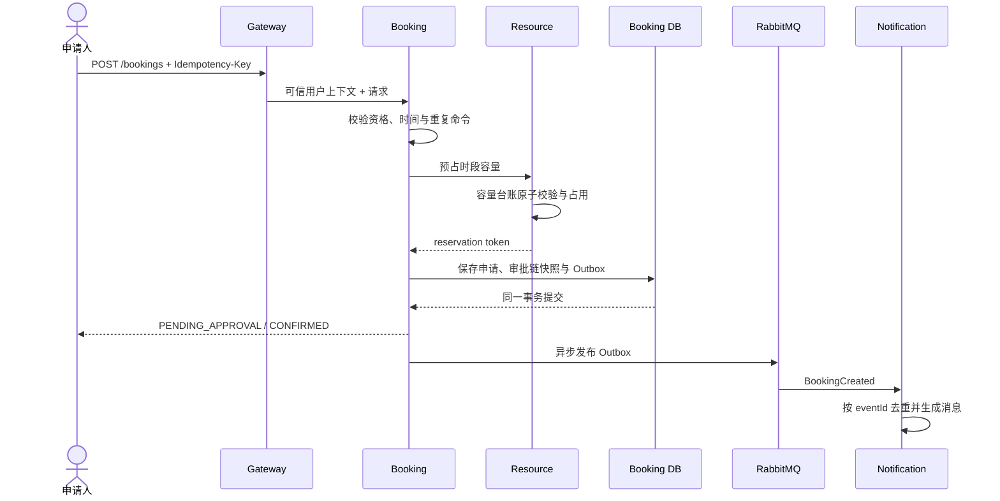

# 预约核心时序

## 关键不变量

1. 同一幂等键和等价请求只能产生一个业务结果。
2. 资源容量不足时，在创建预约事实之前拒绝请求。
3. 预约保存失败时释放预占；长期未完成状态由超时任务和对账流程补偿。
4. 审批策略在提交时转为快照，进行中的流程不受后续模板变更影响。
5. 只有当前待办节点可推进审批，驳回立即终止剩余节点。

## 失败处理

| 失败点 | 行为 |
|---|---|
| 浏览器重复提交 | 返回已有幂等结果 |
| 容量预占失败 | 不创建预约 |
| 预约事务失败 | 触发容量释放/后续补偿 |
| MQ 暂时不可用 | Outbox 保留，稍后重投 |
| 通知消费重复 | 消费记录去重，不重复生成消息 |
