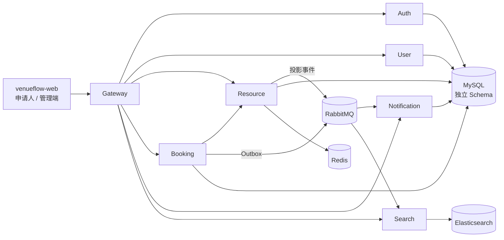

# 容器视图

| 容器 | 状态所有权 | 设计理由 |
|---|---|---|
| Gateway | 无业务状态 | 统一路由、认证入口与跨域策略，降低浏览器对内部拓扑的耦合 |
| Auth | 凭据、会话、OIDC 映射 | 身份生命周期与业务资料分离 |
| User | 档案、组织、成员关系、角色 | 统一人员与组织治理边界 |
| Resource | 资源、时段、规则、容量、审批策略 | 可用性和资源约束在同一一致性边界内 |
| Booking | 申请、审批快照、状态历史、Outbox | 预约聚合是流程事实的唯一来源 |
| Notification | 站内消息、消费去重 | 通知失败不阻塞核心交易 |
| Search | 检索投影 | 搜索模型可从资源事实重建 |

## 通信原则

- 浏览器到服务：同步 HTTP，经 Gateway 进入。
- 需要立即决策的领域协作：同步 HTTP，并使用幂等键与补偿保护。
- 不影响交易提交的派生能力：RabbitMQ 异步事件。
- 服务不跨库读写；展示所需的跨域数据通过接口或投影获得。
