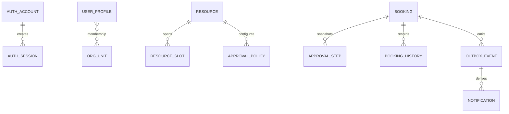

# 数据模型与所有权

VenueFlow 遵循“服务拥有数据”的原则。多个服务可以保存同一业务对象的必要快照，但只有拥有者能修改事实。

| 数据域 | 权威服务 | 说明 |
|---|---|---|
| 账户、凭据、会话、OIDC 映射 | Auth | 不向其他服务暴露密码材料 |
| 人员档案、组织单元、成员关系、平台角色 | User | 外部组织标识作为同步幂等键 |
| 资源、分类、开放时段、容量台账、申请规则、审批模板 | Resource | 资源可用性的唯一事实来源 |
| 预约、审批步骤快照、状态历史、核销、Outbox | Booking | 流程状态的唯一事实来源 |
| 站内通知、消费记录 | Notification | 可由领域事件派生 |
| 资源检索文档 | Search | 可重建读模型 |

## 快照策略

- 预约保存资源名称等必要展示信息，避免历史记录因资源改名失去当时语义。
- 审批步骤保存提交时的顺序、审批人和组织信息，保证审计可复现。
- 快照不是新的权威配置；后续新申请仍读取 Resource 与 User 的最新事实。

## 演进策略

每个持久化服务通过自己的 Flyway 迁移管理 Schema，迁移只增量前进。跨服务变更先保证生产者/消费者兼容，再移除旧字段或旧事件版本。
