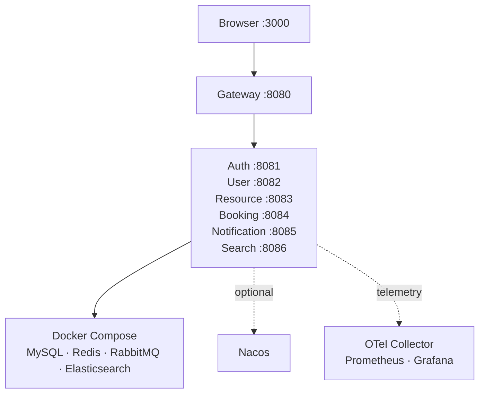

# 部署视图

## 本地完整演示

`scripts/local-dev/start.ps1` 负责生成本地密钥、启动基础设施、创建数据库、启动服务、执行数据播种并等待健康检查。运行文件和秘密位于未跟踪目录，不进入 Git。

## Profile 约定

- 默认 profile：适合不连接外部依赖的单元与组件测试。
- `persistence`：启用 MySQL/Flyway 和真实持久化实现。
- 消息、搜索、注册中心和可观测能力按运行目标附加启用。
- 浏览器联调统一走 Gateway，不使用各服务端口绕过安全边界。

## 生产化差距

当前仓库提供可运行拓扑和运维基线，但不把本地 Compose 冒充生产部署。真实上线应补充：

- 容器镜像仓库、编排平台、滚动发布与回滚策略。
- 正式域名、TLS、Secret 管理、网络策略和最小权限账户。
- 高可用 MySQL/Redis/RabbitMQ/Elasticsearch 及备份恢复演练。
- 学校 IdP 和权威组织源联调。
- 针对目标容量的压测、安全审计、告警阈值和灾备目标。
