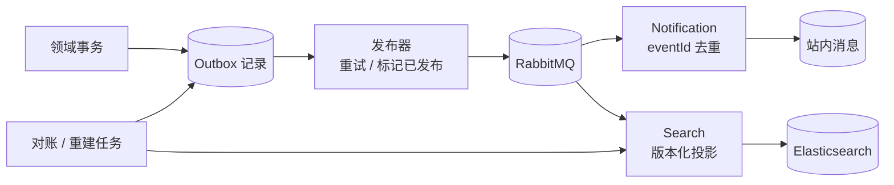

# 事件流与最终一致性

VenueFlow 使用事务 Outbox 把“业务状态已改变”和“需要通知其他服务”绑定在同一数据库事务中，避免数据库提交成功但消息丢失的双写问题。

## 交付语义

- 生产侧按“至少一次”设计：未确认的 Outbox 可再次发布。
- 消费侧按幂等设计：重复事件不会重复产生用户可见结果。
- 搜索和通知允许短暂延迟，但预约与容量事实不依赖它们成功。
- Elasticsearch 是可重建投影，不是资源事实来源。

## 可恢复性

- Outbox 状态支持定位待发布与失败记录。
- 消费去重表保留已处理事件标识。
- 搜索支持从资源事实重新投影。
- 容量与预约提供对账流程，处理跨服务调用在未知结果下留下的不一致。
