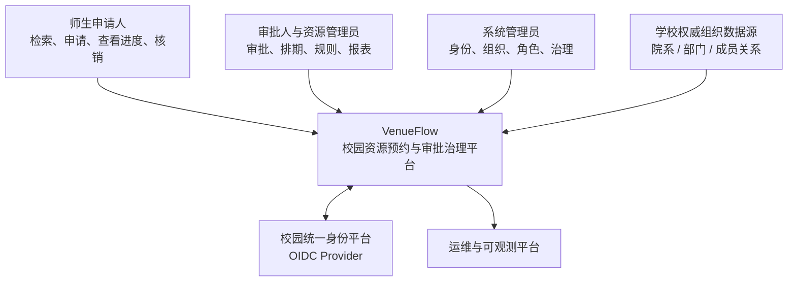

# 系统上下文

VenueFlow 的核心边界是校园资源治理。它不替代学校主数据平台或统一身份平台，而是消费身份与组织信息，负责资源申请之后的交易、审批和审计。

## 主要参与者

- 申请人：查看可用资源与规则，创建、撤回、取消或复用申请，跟踪审批和通知。
- 审批人：只处理当前节点分配给自己且在权限范围内的申请。
- 资源管理员：维护资源资料、开放时段、容量规则、归属部门和审批策略。
- 系统管理员：维护全局角色、组织同步和治理配置，并拥有跨组织运营视图。

## 信任边界

- 浏览器只向 Gateway 提交令牌，不直接访问内部服务。
- Gateway 验证令牌并生成可信身份头；内部服务不信任浏览器自行声明的用户或角色。
- IdP 负责证明身份，VenueFlow 负责业务权限。成功登录不等于拥有资源管理或审批权限。
- 组织同步是受控写入：全量同步建立基线，增量同步按外部标识幂等更新。
